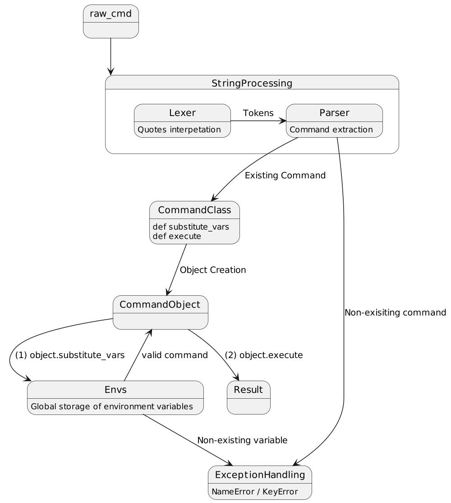

Состав команды:
- Ильнур Галиев
- Маргарита Лазарева
- Ильсияр Фаттахова

# I этап. Реализация команд `cat`, `echo`, `wc`, `pwd`, `exit`

<ins>Подходы к решению</ins>

- Чтение сырой строки
- Парсинг строки
- Создание объекта под соответствующую команду или обработка исключения (при некорректной команде)
- Вывод результата
- Последующее чтение команд до терминирующего условия (exit, и т.д.)

Пример обработки одной команды:

<ins>Описание основных сущностей</ins>:

Лексер - сущность для разбиения на токены в зависимости от кавычек. Двойные кавычки необходимо интерпретировать, одинарные - воспринимать как строковые литералы. Результат работы лексера - список интерпретируемых значений (команды, переменные окружения), список обычных строковых литералов (примеры?).

Парсер - чтение списка исполняемых объектов, рассмотрение case'ов `(if... elif...else...)`, создание объекта в зависимости от полученной команды, бросание Exception'a в случае получения невалидной (нереализованной) команды (вывод, что текущая программа завершилась с ненулевым кодом ошибки).

Глобальное хранилище (словарь) переменных окружения - добавить все имеющиеся в системе переменные + занесение новых вводимых переменных. (Как будем добавлять изначальный пулл env'ов?)

Класс Command - общий интерфейс для всех реализуемых команд, содержит функции substitute_vars,
execute. Стандартная реализация substite_vars - проверка наличия переменной окружения
в глобальном хранилище (context). Стандартная реализация execute - os.system(raw_cmd) (?)

Классы CommandCat, CommandEcho, CommandWc... - реализации интерфейса Command под каждую команду.

<ins>Подводные камни</ins>

- Работа с кавычками
  - обработка вложенных кавычек
  - литеральные/не литеральные строки (одинарные/двойные кавычки соответственно)
- установка переменной окружения
  - игнорирование/включение пробелов справа от присваивания когда нет кавычек
  - подставлять только один раз (исключить рекурсивную подстановку)
- интерпретация спецсимволов (`$`, и т.д.)
- терминирующие условия (только exit, исключения обрабатываем?)

# II этап.  Реализация конвейерной обработки команд (pipe)

- класс `Pipeline`
  - содержит список `Command` (для текущей итерации обработки)

<ins>Подводные камни</ins>:
- `exit` внутри `pipe`?
